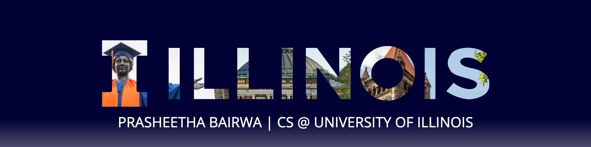

  

# Hey, I'm Pras 

Computer Science @ **University of Illinois Urbana-Champaign (4.0 GPA)**  
AI systems engineer interested in **retrieval systems, multimodal AI, and computer vision**.

🔗 **Portfolio:**  
https://prasbb.github.io/prasbb-portfolio/

---

# About Me

### AI Systems Engineering
**AI Intern — Kongsberg Digital**

Built a **retrieval-augmented generation (RAG) system** for querying industrial digital twin data.  
Implemented multimodal retrieval pipelines and parallel retrievers to improve response latency and retrieval accuracy.

Focus areas:
- LLM orchestration
- retrieval pipelines
- system latency optimization
- multimodal document retrieval

---

### Machine Learning Research
**Research Assistant — Cellular Neuroscience Imaging Lab (UIUC)**

Developed deep learning pipelines for **label-free segmentation of SLIM microscopy images**.

Key work:
- CNN / YOLO / Cellpose segmentation pipelines
- automated microscopy analysis
- biomedical imaging systems
- scalable label-free computer vision workflows

Research supervised by **Dr. Catherine Best-Popescu**.

---

### Teaching & Systems Work

**Course Assistant — CS233 (Computer Architecture)**  
Maintained and supported **SpimBot**, a MIPS-based autonomous agent simulator used by 200+ students.

**Mentor — CS124 Honors**

Mentored student teams developing CNN models for **galaxy morphology classification** and helped develop introductory course material on computer vision.

---

# Technical Toolkit

### Languages & Systems
Python • SQL • C++ • C • Java • Rust • Verilog • MIPS Assembly

### Machine Learning
Deep Learning • Computer Vision • NLP • Retrieval-Augmented Generation • Multimodal AI • Federated Learning

### Frameworks & Libraries
PyTorch • TensorFlow • Scikit-learn • LangChain • OpenCV

### Tools & Infrastructure
Docker • Git • Linux • Azure DevOps

---

# Selected Projects

### Transformer From Scratch
Implemented a full **encoder–decoder Transformer architecture in PyTorch**, including multi-head attention, positional encoding, and attention masking.

### Local Retrieval-Augmented Generation System
Built a local **RAG pipeline** using LangChain, ChromaDB, and Ollama embeddings for semantic document retrieval.

### Federated Facial Detection
Implemented a **privacy-preserving federated learning system in Rust** using federated averaging across distributed clients.

---

# Awards

**URSA Best Overall Presentation Award**  
University of Illinois Research Symposium

**James Scholar**  
**Dean's List (all semesters)**

**Scholarships**
- Illinois Engineering Achievement Scholarship  
- Grainger College of Engineering Outstanding Scholarship

---

# Connect

Portfolio → https://prasbb.github.io/prasbb-portfolio/  
LinkedIn → https://www.linkedin.com/in/prasheetha-bairwa/  
